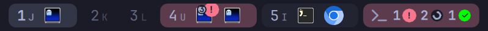
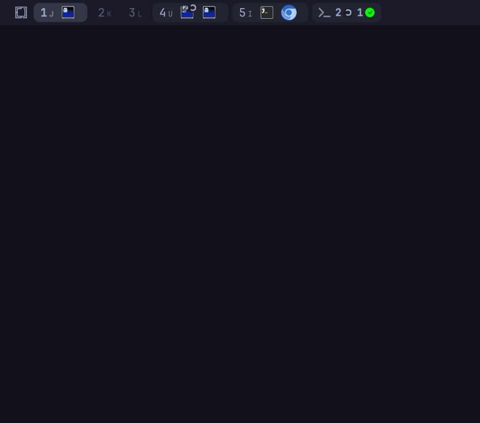
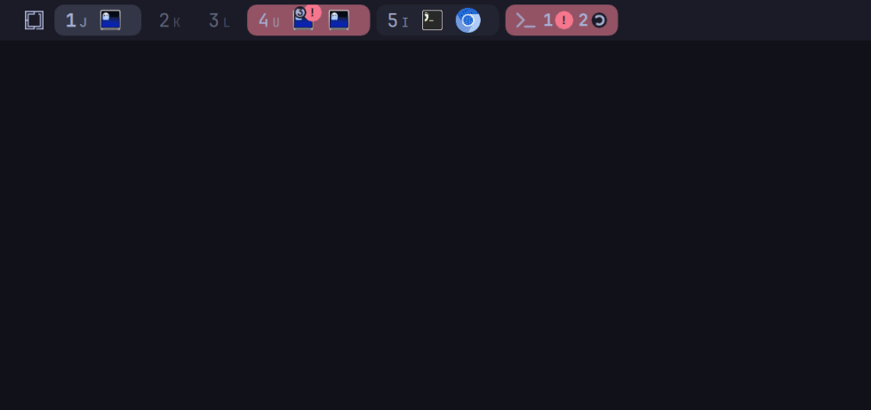
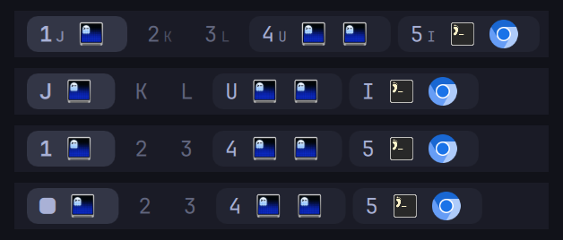
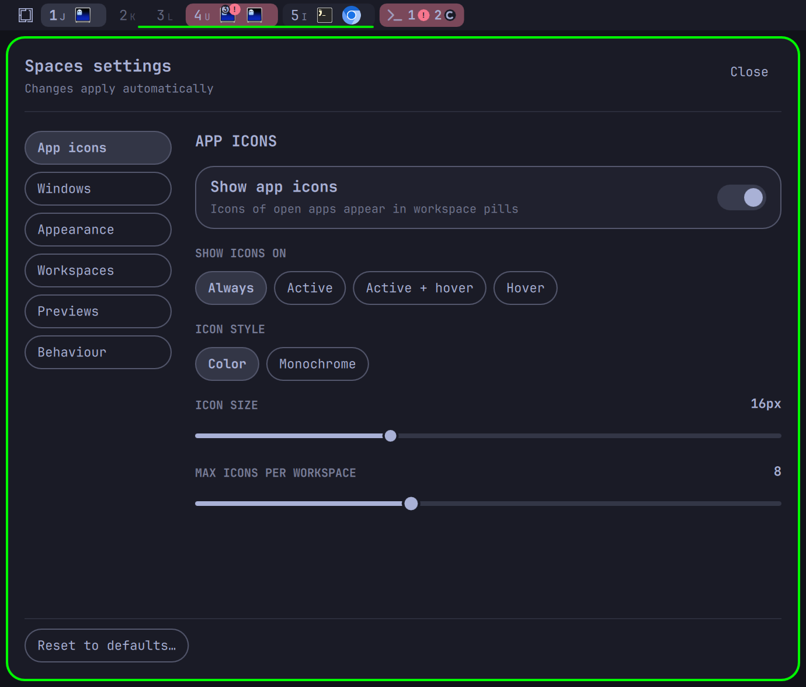

<h1 align="center">Spaces</h1>

<p align="center">A workspace switcher for the Omarchy bar that shows the apps on every workspace, the keys that reach it, and what your coding agents are doing.</p>

<p align="center">
  <a href="LICENSE"></a>
  <a href="https://omarchy.org"></a>
  <a href="https://hypr.land"></a>
  <a href="https://github.com/cyperx84/omarchy-spaces/actions/workflows/test.yml"></a>
</p>

<p align="center">
  
</p>

Spaces replaces Omarchy's built-in workspace switcher. Each workspace is a pill in the bar that shows the icons of the apps open on it, and the active pill slides open to show them. Hover a pill to see a live miniature of that workspace, and read its shortcut from your own Hyprland binds. If you run coding agents in [Herdr](https://herdr.dev), the terminal hosting Herdr gets a badge for what they are doing, and an agents chip lists every agent so you can jump to the one that needs you.

Spaces started as [omarchy-spaces](https://github.com/tornikegomareli/omarchy-spaces) by Tornike Gomareli. See [Credits](#credits).

## Features

### Workspace pills with app icons

Each workspace is a pill labelled with its number. The active pill, and any pill you hover, shows the icon of every window on that workspace, ordered the way they sit on screen. The focused window is highlighted, and the others on the active workspace are dimmed. Click a pill to go to that workspace, click an icon to focus that window, and scroll over the bar to step through workspaces. Icons come from your desktop entries and icon theme, including Chromium web apps. An app with no icon gets a letter tile.

### Live previews

<p align="center">
  
</p>

Hover a pill for another workspace and a preview card opens with a live miniature of it, each window where it really is on screen. Move along the bar and the card slides from pill to pill. Click a window in the miniature to jump to it. Previews follow the monitor's orientation, so portrait and rotated displays work too.

### Agent status from Herdr

<p align="center">
  
</p>

[Herdr](https://herdr.dev) is a terminal multiplexer for coding agents, and it already knows what every agent in its panes is doing. Spaces listens to it. The terminal window running Herdr gets a badge: a spinner while an agent works, a pulsing `!` when one is blocked on you, and a check mark when one is done. A workspace with a blocked agent pulses until you go there.

After the pills, the agents chip counts waiting, working and done agents. Click it for a popup with one row per agent, newest change first. Click a row to focus that agent's pane in Herdr and the Herdr window in Hyprland. Without Herdr, none of this shows and nothing breaks. See [docs/agents.md](docs/agents.md).

### Key hints from your own binds

<p align="center">
  
</p>

Spaces reads `hyprctl binds -j` and works out which key switches to each workspace, so the pill can show it. If `SUPER + J` takes you to workspace 1, its pill reads `1` with a small `J`. It follows whatever you have bound, either Omarchy's Lua binds or classic `workspace` binds, and reads them again when Hyprland reloads its config. Hover a pill for a tooltip that names the keys to switch there and to move a window there. See [docs/key-hints.md](docs/key-hints.md).

### Settings panel



Right-click the widget to open its settings. Six pages cover app icons, windows and agents, appearance, workspaces, previews and behaviour. Changes apply as you click and are saved to `~/.config/omarchy/shell.json`.

The panel works from the keyboard: Tab and Shift+Tab move between controls, Enter or Space activates one, Left and Right move a slider by one, Home and End jump to its ends, and Escape closes the panel. "Reset to defaults" asks before it resets anything.

<br clear="right" />

## Requirements

- Omarchy 4 with its Quickshell bar
- Hyprland 0.56 or newer
- For agent status only: [Herdr](https://herdr.dev) and `python3`

Spaces works with the bar on any edge of the screen. It is tested on a single monitor.

## Install

Add the plugin. Omarchy clones it into `~/.config/omarchy/plugins/cyperx84.spaces` and asks you to confirm first. Plugins are added disabled so you can read the code before running it.

```sh
omarchy plugin add https://github.com/cyperx84/omarchy-spaces.git
```

Put it in the left section of the bar, next to the built-in switcher:

```sh
omarchy plugin enable cyperx84.spaces --section left --after omarchy.workspaces
```

Optionally, remove the built-in switcher so you only have one:

```sh
omarchy plugin disable omarchy.workspaces
```

`omarchy plugin add ... --enable` does the first two steps in one go and asks which section to use.

## Using it

| Action | Where | What it does |
| --- | --- | --- |
| Left-click | A pill | Go to that workspace |
| Left-click | The active pill | Nothing, or go back to the previous workspace with "Clicking the active workspace" set to "Goes back" |
| Left-click | An app icon | Focus that window. On a grouped icon that is already focused, cycle through its windows |
| Middle-click | An app icon | Close that window, when "Middle-click icon closes window" is on |
| Scroll | Anywhere on the widget | Step to the next or previous workspace, wrapping around |
| Hover | A pill | Show its app icons and its shortcut tooltip, and, for another occupied workspace, its preview card |
| Hover | An app icon | Show the window title, and the agent status on a Herdr window |
| Left-click | A window in the preview card | Focus that window |
| Left-click | The agents chip | Open or close the agents popup |
| Left-click | A row in the agents popup | Focus that agent's pane in Herdr and the Herdr window |
| Right-click | Anywhere on the widget | Open or close the settings panel |

A gear button for the settings can be turned on under Appearance, "Settings button".

## Keyboard and scripting

Spaces answers IPC calls through `omarchy-shell`, so you can bind them to keys:

```sh
omarchy-shell cyperx84.spaces toggle    # open or close the settings panel
omarchy-shell cyperx84.spaces peek 3    # show the preview card for workspace 3
omarchy-shell cyperx84.spaces agents    # open or close the agents popup
```

For example, in `~/.config/hypr/bindings.lua`:

```lua
o.bind("SUPER + CTRL + ALT + S", "Spaces settings", "omarchy-shell cyperx84.spaces toggle")
```

Every method, its return value and more bindings are in [docs/scripting.md](docs/scripting.md).

## Configuration

Every setting is in the settings panel, and can also be set from a script with `omarchy bar set`. True/false values need `--json`:

```sh
omarchy bar set cyperx84.spaces showApps all
omarchy bar set cyperx84.spaces groupApps true --json
```

The settings people change most:

| Setting | Key | Values | Default |
| --- | --- | --- | --- |
| Show icons on | `showApps` | `all`, `active`, `hover`, `hoverOnly` | `hover` |
| Workspace label | `labelStyle` | `number`, `key`, `both`, `glyph`, `none` | `both` |
| Active workspace | `activeStyle` | `subtle`, `solid`, `accent` | `subtle` |
| Always show workspaces | `persistentWorkspaces` | 0 to 10 | `5` |
| Group windows by app | `groupApps` | `true`, `false` | `false` |
| Workspace previews | `previews` | `true`, `false` | `true` |
| Agents chip | `agentChip` | `auto`, `always`, `never` | `auto` |
| Density | `density` | `compact`, `normal`, `roomy` | `normal` |

All settings, with what each one does: [docs/configuration.md](docs/configuration.md).

## Update

```sh
omarchy plugin update cyperx84.spaces
```

Omarchy shows the diff, fast-forwards the checkout and reloads plugin code. If the bar still shows the old version, run `omarchy restart shell`.

## Remove

```sh
omarchy plugin remove cyperx84.spaces
omarchy plugin enable omarchy.workspaces   # bring back the built-in switcher
```

If you bound any `omarchy-shell cyperx84.spaces` calls to keys, remove them from `~/.config/hypr/bindings.lua`.

## Troubleshooting

- **The widget does not appear after installing.** Plugins are added disabled. Run `omarchy plugin enable cyperx84.spaces --section left`.
- **No agent badges.** Herdr has to be running, `python3` has to be installed, and Herdr's client has to run in a terminal window. Check with `python3 ~/.config/omarchy/plugins/cyperx84.spaces/hooks/herdr-feed --once`, which prints what Spaces sees.
- **No key captions.** Spaces can only show a key Hyprland reports by name. Omarchy's stock `SUPER + 1` to `SUPER + 0` binds are reported without one, so with them the pills show only numbers. Run `hyprctl binds -j` to see what Spaces sees.
- **Every terminal window gets the badge.** Your terminal serves several windows from one process, so Spaces cannot tell which one runs Herdr.

More, with causes and fixes: [docs/troubleshooting.md](docs/troubleshooting.md).

## Documentation

- [Configuration](docs/configuration.md): every setting, its key, values and default
- [Agent status](docs/agents.md): Herdr badges, the agents chip and popup, reporting other agents, demo mode
- [Key hints](docs/key-hints.md): how binds are read, label styles and the shortcut tooltip
- [Scripting](docs/scripting.md): IPC methods and example key bindings
- [Troubleshooting](docs/troubleshooting.md): symptoms, causes and fixes
- [Development](docs/development.md): architecture, tests and releasing
- [Changelog](CHANGELOG.md)

## Contributing

Bug reports, fixes and ideas are welcome. Read [CONTRIBUTING.md](CONTRIBUTING.md) for how to report a bug, set up a development copy and run the tests.

## Credits

Spaces began as [omarchy-spaces](https://github.com/tornikegomareli/omarchy-spaces) by [Tornike Gomareli](https://github.com/tornikegomareli), released under the MIT license. The pill and icon design, the live previews, the settings panel and the original idea of agent badges on terminal windows are his work, and much of the code here is still his.

The original project's contributors are part of this one too: [@tseluka](https://github.com/tseluka) (pill background setting, focused-icon fix), [@Natetgmaxwell](https://github.com/Natetgmaxwell) (sharper icons, distinct letter tiles), [@tcballard](https://github.com/tcballard) (the six settings pages and keyboard support), [@FarzadHayat](https://github.com/FarzadHayat) (OpenCode reporter, clearing badges left by crashed agents), [@VulpesZerda27](https://github.com/VulpesZerda27) (portrait and rotated previews), [@a-lang](https://github.com/a-lang) (omp reporter), [@Coding-Sparrow](https://github.com/Coding-Sparrow) and [@movshuri](https://github.com/movshuri) (fixing and reporting pills that vanished after an animation change). Their work is listed in the [inherited changelog](CHANGELOG.md#before-20-omarchy-spaces-by-tornike-gomareli). Thank you.

This project, maintained by [Cyperx](https://github.com/cyperx84), changes and adds:

- Agent status read from Herdr through `hooks/herdr-feed`, in place of the per-agent hooks for Claude Code, OpenCode and omp
- The agents chip, the agents popup and agent rows on the preview card
- Key captions and shortcut tooltips read from your live Hyprland binds
- Tooltips on app icons and the settings gear, which did not show before

Spaces runs on [Omarchy](https://omarchy.org), [Quickshell](https://quickshell.org) and [Hyprland](https://hypr.land), and gets agent status from [Herdr](https://herdr.dev).

## License

[MIT](LICENSE). Copyright (c) 2026 Tornike Gomareli and (c) 2026 Cyperx.
