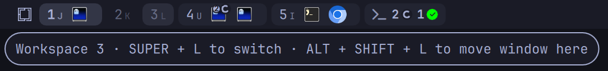

# Key hints

Spaces can show, on each workspace pill, the key that takes you to that workspace. It reads the keys from Hyprland's live binds rather than assuming Omarchy's defaults, so it follows whatever you have bound. Hovering a pill also shows a tooltip with the keys that switch to it and move a window to it.

## Label styles

<p align="center">
  
</p>

The "Workspace label" setting under Appearance (`labelStyle`) chooses what each pill says. Take a setup where `SUPER + J` switches to workspace 1:

| Panel label | Value | Pill for workspace 1 | Without a bind |
| --- | --- | --- | --- |
| Number + key | `both` (default) | `1` with a small `J` after it | `1` |
| Key | `key` | `J` | `1` |
| Number | `number` | `1` | `1` |
| Glyph | `glyph` | A glyph on the active pill, `1` otherwise | Same |
| None | `none` | No label | No label |

In the Number + key style, the caption sits after the number on a horizontal bar and under it on a vertical bar. It is left out when it would only repeat the number, as with `SUPER + 3` for workspace 3. Workspace 10 is labelled `0` in every style that shows a number.

## The shortcut tooltip

Hover a pill, away from its app icons, and a tooltip names its keys:

```text
Workspace 1 · SUPER + J to switch · ALT + SHIFT + J to move window here
```

A part with no bind is left out, and a pill with no bind at all has no tooltip. The tooltip does not show while the pill's own preview card is open, and app icons inside the pill have their own tooltip. Turn it off with "Shortcut tooltips" under Behaviour (`keyTooltips`); it does not depend on the general "Tooltips" setting.

<p align="center">
  
</p>

## How binds are detected

Spaces runs `hyprctl binds -j` when it starts and reads two kinds of bind. Some binds come back without their key; [How missing keys are recovered](#how-missing-keys-are-recovered) explains how Spaces fills those in.

**Omarchy's Lua binds.** Omarchy 4 sets up its binds from Lua, so Hyprland lists them with the dispatcher `__lua` and the meaning is only in the bind's description. Spaces matches these descriptions, ignoring case:

| Description | Counts as |
| --- | --- |
| `Switch to workspace N` | Switch key for workspace N |
| `Move window to workspace N` | Move key for workspace N |
| `Move window silently to workspace N` | Move key for workspace N |

So a bind in `~/.config/hypr/bindings.lua` is picked up when its description follows that wording:

```lua
o.bind("SUPER + J", "Switch to workspace 1", hl.dsp.focus({ workspace = "1" }))
o.bind("ALT + SHIFT + J", "Move window to workspace 1", hl.dsp.window.move({ workspace = "1" }))
```

**Classic dispatcher binds.** Binds from a `hyprland.conf`-style config are read by their dispatcher, whatever their description:

| Dispatcher | Counts as |
| --- | --- |
| `workspace` | Switch key |
| `movetoworkspace` | Move key |
| `movetoworkspacesilent` | Move key |

Only a plain workspace number counts as the argument. Relative or named targets such as `e+1`, `previous` or `name:web` are not tied to one pill and are skipped.

## Special workspaces

The scratchpad pill, and the pill of any other special workspace, has a tooltip of its own. It always names the workspace, since its label may be only a glyph, and adds the keys that toggle it and move a window to it when "Shortcut tooltips" is on:

```text
Scratchpad · SUPER + S to toggle · SUPER + ALT + S to move window here
```

With "Shortcut tooltips" off, or without binds, the tooltip reads just `Scratchpad` (or the special workspace's name); with both "Shortcut tooltips" and "Tooltips" off there is none. Special pills keep their glyph or short name in every label style, and never show a key caption.

These binds are read from the same `hyprctl binds -j` and `hooks/bind-keys` data as the workspace binds, so keys made by key code are recovered the same way. Lua binds count by description, ignoring case:

| Description | Counts as |
| --- | --- |
| `Toggle scratchpad` | Toggle key for the scratchpad |
| `Toggle special workspace NAME` | Toggle key for special workspace NAME (without NAME, the unnamed one) |
| `Move window to scratchpad`, `Move window silently to scratchpad` | Move key for the scratchpad |
| `Move window to special workspace NAME`, `Move window silently to special workspace NAME` | Move key for special workspace NAME |

Omarchy's stock binds, `o.bind("SUPER + S", "Toggle scratchpad", ...)` and `o.bind("SUPER + ALT + S", "Move window to scratchpad", ...)`, match the first and third rows. Classic binds count by dispatcher:

| Dispatcher | Argument | Counts as |
| --- | --- | --- |
| `togglespecialworkspace` | `NAME`, or empty for the unnamed one | Toggle key |
| `movetoworkspace`, `movetoworkspacesilent` | `special:NAME`, or `special` for the unnamed one | Move key |

When several binds reach the same special workspace, a plain move beats a silent one, and otherwise the first listed wins. Submap and mouse binds are skipped, as for workspaces.

## How missing keys are recovered

Hyprland 0.56 lists two kinds of bind without a key name:

- **Binds made by key code**, such as `bind = SUPER, code:10, workspace, 1`. These come with an empty key name and the key code, here `10`.
- **Lua binds made by key code**, such as Omarchy's stock `o.bind("SUPER + code:10", "Switch to workspace 1", ...)`. These come with an empty key name and key code `0`, so `hyprctl` gives no hint of the key at all. Omarchy's own `SUPER + 1` to `SUPER + 0` workspace binds are all of this kind.

Spaces fills in both the way Omarchy's keybindings menu (`omarchy-menu-keybindings`) does, with a small helper, `hooks/bind-keys`. It is a Python 3 script, standard library only, that Spaces runs alongside `hyprctl binds -j`. It prints one JSON document:

```json
{"keymap": "xkbcli", "config": "lua",
 "keycodes": {"10": "1", "19": "0", "20": "minus", "44": "j", "...": "..."},
 "binds": [{"modmask": 64, "description": "Switch to workspace 1", "key": "code:10"}, "..."]}
```

**The keymap.** `keycodes` maps each key code to the first symbol on that key, read from `xkbcli compile-keymap` with the layout and variant from Hyprland's `input:kb_layout` and `input:kb_variant` (the first one, if you list several). If `xkbcli` is missing or fails, a built-in table covers the keys Omarchy binds by code: 10 to 19 are `1` to `0`, 20 is `minus`, 21 `equal`, 59 `comma`, 60 `period` and 61 `slash`. `keymap` says which one was used. A bind made by key code is then shown with that symbol, so `code:10` is shown as `1` and `code:20` as `-`.

**The Lua source.** `binds` lists every bind with a description that your `~/.config/hypr/hyprland.lua` makes, in the order it makes them, with the key as written in the source. To get it, the helper runs your config in a separate `lua` process in which Hyprland's `hl` table is a stub that only records binds, as Omarchy's menu does. The run is also kept read-only: files can only be opened for reading, `os.execute`, `os.remove`, `os.rename`, `os.exit`, `io.output` and C modules are disabled, and `io.popen` only runs the `find` directory listing that Omarchy's config uses to load its bind files. `config` is `lua` when this ran and `none` when there is no `hyprland.lua` or no `lua`.

Spaces then matches a bind that `hyprctl` lists without a key to the source bind with the same modifiers and description, skipping source keys that `hyprctl` already shows for that description. So Omarchy's `Switch to workspace 1` on `SUPER` gets `code:10`, shown as `1`, while your own `SUPER + J` with the same description keeps its `J`.

Each step of the helper has a three second limit. Without `python3` it does not run, and if anything fails it leaves that part empty, writes nothing to stderr and exits 0. Spaces then shows what `hyprctl` reports by itself: binds by key name work, and binds by key code show as `code:N` (classic) or are skipped (Lua).

## Which bind wins

When several binds reach the same workspace, for example Omarchy's `SUPER + 1` and your own `SUPER + J`, Spaces picks one per workspace, separately for switch keys and move keys:

1. For move keys, a plain move beats a silent one.
2. Then a key other than the workspace's own number beats the number. `SUPER + 1` for workspace 1 is the default every Omarchy setup has, so any other key reaching workspace 1 is one you bound yourself. With Omarchy's binds and your own `SUPER + J` and `ALT + SHIFT + J` for workspace 1, the pill shows `J` and the tooltip names `ALT + SHIFT + J`; workspaces you did not rebind keep `SUPER + 7` and `SUPER + SHIFT + 7`.
3. Then the modifiers used most often across all binds of that kind win. If you bound six workspaces to `SUPER + letter` and two leftovers use `CTRL + letter`, the `SUPER` binds win. This keeps one consistent scheme on the bar.
4. On a tie, the bind with the lower Hyprland modifier mask wins.
5. On a further tie, the bind listed first by `hyprctl` wins.

## How keys are written

Modifiers are written in the order `SUPER`, `CTRL`, `ALT`, `SHIFT`, followed by `CAPS`, `MOD2`, `MOD3` and `MOD5` when used, and joined with ` + `. Single letters are shown in capitals and digits as they are. These key names get a friendlier spelling:

| Hyprland key name | Shown as |
| --- | --- |
| `comma` | `,` |
| `period` | `.` |
| `slash` | `/` |
| `minus` | `-` |
| `equal` | `=` |
| `grave` | `` ` `` |
| `bracketleft` | `[` |
| `bracketright` | `]` |
| `semicolon` | `;` |
| `apostrophe` | `'` |
| `backslash` | `\` |
| `space` | `Space` |
| `Return` | `Enter` |
| `Tab` | `Tab` |
| `Escape` | `Esc` |

Any other key is shown as Hyprland names it, for example `F5`. A bind made by key code is shown with the symbol the keymap gives that code, spelled the same way, so `code:10` is `1` and `code:20` is `-` (see [How missing keys are recovered](#how-missing-keys-are-recovered)). A code the keymap does not know is shown as `code:N`.

## When binds are read again

Spaces reads the binds, and runs `hooks/bind-keys`, once at startup and again half a second after Hyprland reports a config reload. Saving your Hyprland config normally triggers a reload, so a new bind shows on the bar a moment later. If `hyprctl binds -j` fails, Spaces keeps the keys it already knew.

## What is skipped

- Binds inside a submap: they only work after entering the submap, so they are not the key that reaches a workspace.
- Mouse binds.
- Binds with an empty key name and no key code whose key cannot be recovered: a Lua bind with no description, one that `hooks/bind-keys` cannot find in your `hyprland.lua` with the same modifiers and description, and every such bind when the helper cannot run.
- Binds whose description or dispatcher does not match the patterns above.

## My keys do not show

1. **Check the label style.** Under Appearance, "Workspace label" must be "Number + key" or "Key". Number, Glyph and None never show keys.
2. **Check that the key is not the number.** In "Number + key", `SUPER + 3` on workspace 3 shows no caption, because it would read `3 3`.
3. **Check the helper.** Keys for binds made by key code, including Omarchy's stock `SUPER + 1` to `SUPER + 0`, come from `hooks/bind-keys`. Run it and check that `binds` lists your workspace binds and `keycodes` has `"10": "1"`:

   ```sh
   python3 ~/.config/omarchy/plugins/cyperx84.spaces/hooks/bind-keys | jq '{keymap, config, keycode10: .keycodes["10"], binds: [.binds[] | select(.description | test("workspace [0-9]+$"; "i"))]}'
   ```

   `config` reads `none` when there is no `~/.config/hypr/hyprland.lua` or no `lua`; then Lua binds made by key code are skipped. `keymap` reads `fallback` when `xkbcli` is missing, which still covers the number row.
4. **Check the description.** A Lua bind is only recognised by its description. "Go to workspace 1" or "Workspace 1" will not match; it must read "Switch to workspace 1", "Move window to workspace 1" or "Move window silently to workspace 1".
5. **Check for a submap.** Binds inside a submap are skipped.
6. **Reload.** Run `hyprctl reload`, or restart the shell, if Hyprland did not reload after your edit.
7. **Look at what Spaces sees.** This prints every bind Spaces would consider, in the shape it reads them:

   ```sh
   hyprctl binds -j | jq -c '.[]
     | select((.description | test("^(switch to|move window( silently)? to) workspace [0-9]+$"; "i"))
              or (.dispatcher | IN("workspace", "movetoworkspace", "movetoworkspacesilent")))
     | {modmask, key, keycode, dispatcher, arg, description, submap, mouse}'
   ```

   A usable bind has a non-empty `key`, a non-zero `keycode`, or a description that the helper's `binds` lists with the same `modmask`. It also needs an empty `submap` and `mouse` false. For a classic bind, `arg` must be a plain number.
